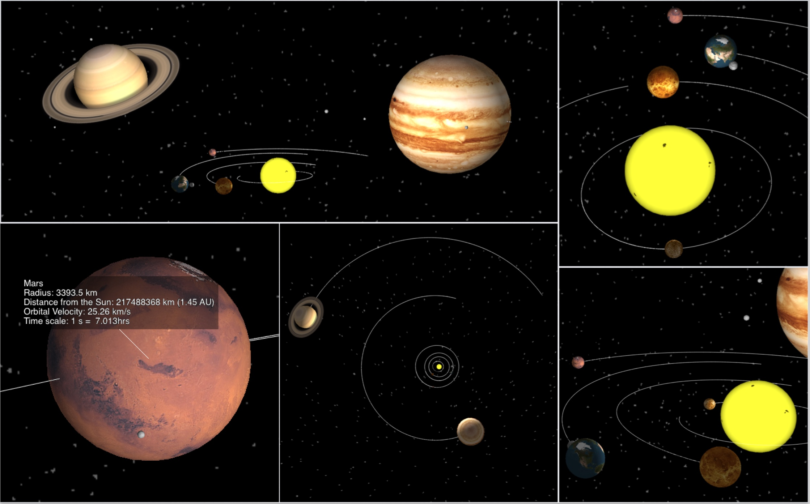

# Solar System Simulation 3D:

##### Features:
* fast and accurate representation of all of the planets and bigger moons using Keplerian elements in 3D (including tilt, spin and tidal locking of applicable moons e.g. Earth’s moon)
* 'real time' data on velocity and position of the selected planet
* possibility to add your own celestial bodies and change the parameters of existing ones (by editing dictionaries in files planets.py and moons.py)

##### Controls:

###### Simulation controls 
* click on the celestial body to center your screen on it - the camera is going to follow
* zoom in by dragging your mouse holding down ALT key
* rotate by dragging your mouse holding down CTRL key
* change the speed of the simulation by pressing Q (speed up) or A (slow down)
* press L to turn on/off the label when in planet/spaceship view (on by default)
* to pause press P
* to exit close the window or press ESC key

###### Spaceship controls:

* press S to enter spaceship mode

    **Thrusters**: (to accelerate faster * just hold the button)
    
    * press ARROW UP to accelerate in the direction of motion
    * press ARROW DOWN to decelerate in the direction of motion 
    * press ARROW RIGHT to accelerate towards the Sun
    * press ARROW LEFT to accelerate from the Sun 
    * press D to accelerate upwards (when in clockwise orbit)
    * press C to accelerate downwards (when in clockwise orbit)
    * press 0 to shut down all thrusters
    
    **Pre-programmed scenarios**: (use them if spaceship goes out of control)
    * press 1 to choose Lagrange point 3 (L3 'counter-Earth')
    * press 2 to choose polar orbit around the Sun
    * press 3 to choose orbit of the probe Helios 2
    * press 4 to choose the orbit of Halley’s comet

##### Requirements:
* simulation requires following Python packages: vPython, NumPy, SciPy

##### Future improvements: 
* some shadows are missing (not supported by vPython module)
* axial precession of planets is not included
* Sun is stationary (not orbiting barycenter)
* gravity of the planets is not accounted for in the spaceship simulation (issues with scale factor for the planets radii)
* moons are not labeled
* due to float precision moons are not perfectly tidally locked 

